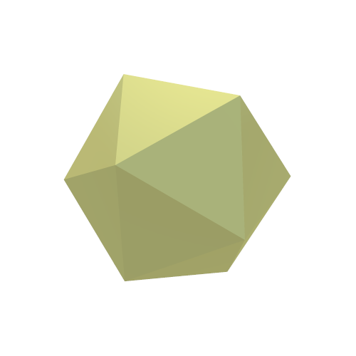
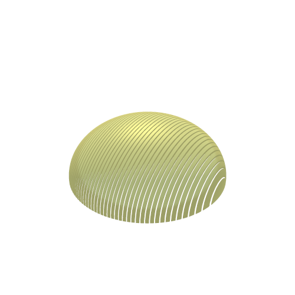
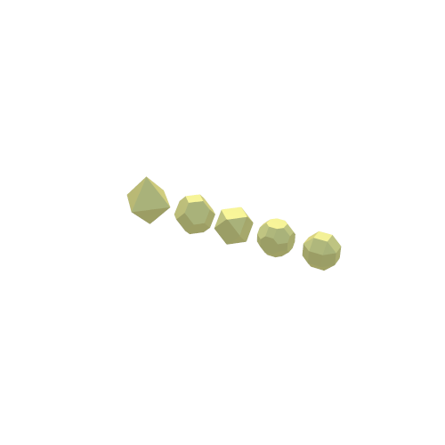
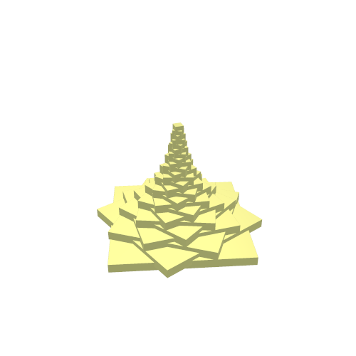
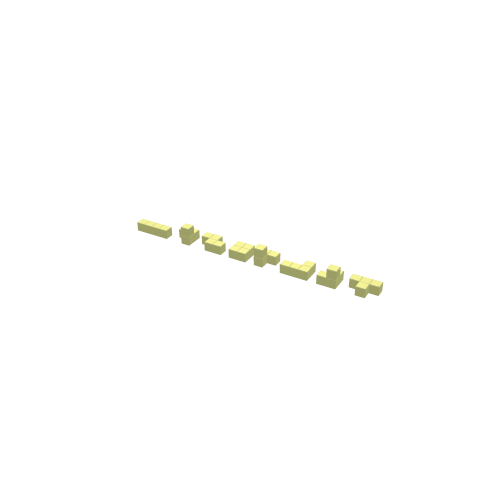
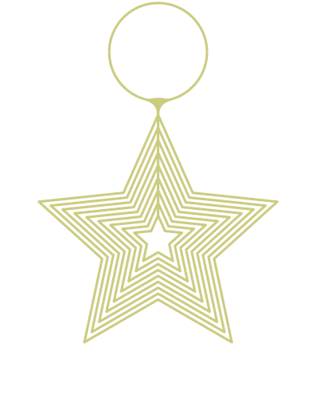
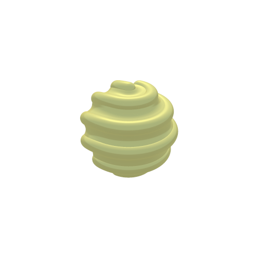

# Scadvent 2021

With the help of Doug Moen and Shadertoy, I will try my best to mimic OpenSCAD results.

Each day may have more than one solution, the "naive" solution, and then the version which
tries its hardest to mimic OpenSCAD.

Sunday|Monday|Tuesday|Wednesday|Thursday|Friday|Saturday
---|---|---|---|---|---|---
|||||||
||||||
